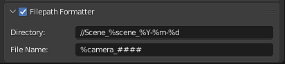

# Blender Filepath Formatter

Blender addon to specify a filepath template for renders and output nodes.

## Installation

- Click [here to download](https://github.com/rmp135/blender-filepath-formatter/archive/main.zip).
- Open Blender
  - Edit -> Preferences -> Install... and select the downloaded zip file.
  - Tick the box to enable.

## Usage

In the Output properties panel, a new setting for "Filepath Formatter" will be visible.

Tick the box in the settings header to enable.

Set the **Directory** to the template for the folder. 

Set the **File Name** to the template for the file name.

- Note: The file name generation has a quirk where you _must_ have a frame number somewhere in the filename. If you don't, Blender will add at to the end. This is built-in behaviour and cannot be changed.

The above options can contain a number of template variables to alter the path / filename. 

### Template Variables

Variable      | Expansion
--------------|----------
%resx         | Render X resolution
%resy         | Render Y resolution
%scene        | Active scene name
%camera       | Active camera name
%filename     | Project file name
\#\#\#\#\#    | Frame number with padding

All datetime variables from the [strftime](https://docs.python.org/3/library/datetime.html#strftime-and-strptime-format-codes) function in Python.

If you have any requests for additional variables, please feel free to raise an issue or pull request.

## Examples

Output the resolution as the folder and current time and frame number as the filename.

Directory: //Renders_%resy/

File Name: %Y-%m-%d_%H_%M_%S-###

Output: //Renders_720/2022-06-27_15_03_23-001.png

---

Output dailies from a scene and camera.

Directory: //%Y-%m-%d/Scene_%scene

File Name: ####_%camera

Output: //2022-06-27/Scene_Outside/0012_Camera.Tracking.png

## Credits

Heavily based off of [this Gist](https://gist.github.com/robertguetzkow/8dacd4b565538d657b72efcaf0afe07e).